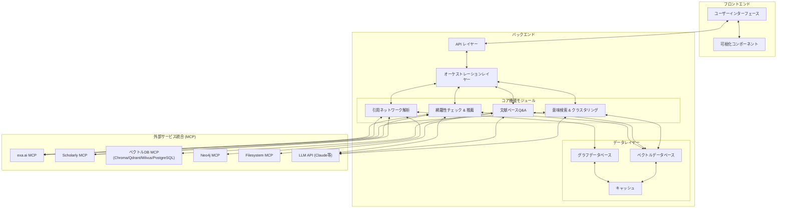
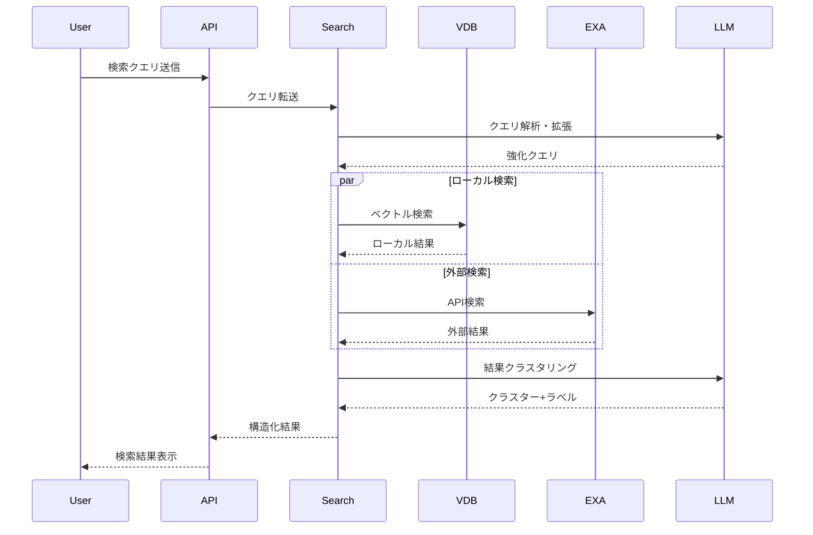
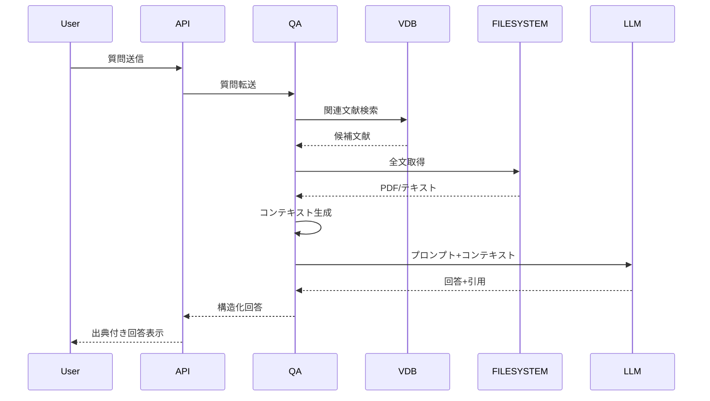

# インテリジェント文献ナビゲーターのアーキテクチャー設計

インテリジェント文献ナビゲーターは研究プロセスの中核となる重要コンポーネントです。効率的で拡張性の高いアーキテクチャーを設計しましょう。

## 1. 全体アーキテクチャー



## 2. コンポーネント詳細設計

### 2.1 データレイヤー

#### ベクトルデータベース (VDB)

- **役割**: 論文や研究資料を意味的に検索可能な形で格納
- **技術選定**: Chroma, Qdrant, Milvus, PostgreSQLなどから選択（または独自実装）。
	- 消去法でPostgreSQLを使用する
		* Chromaはセットアップが最も簡単だが、研究が進み文献データが増えていく場合、将来的に制限に直面する可能性がある
		* Qdrantでは、Claude Desktopなら使用可能だが、GitHub Copilotだと`Failed to validate tool 590_qdrant-store: TypeError: Cannot use 'in' operator to search for 'type' in true`というエラーが出る
		* MilvusはUIでデータを確認する方法が不明
- **データモデル**:
    
    ```json
    {  "document_id": "uuid",  "title": "論文タイトル",  "authors": ["著者1", "著者2"],  "abstract": "要約文",  "full_text": "本文全体",  "publication_date": "2023-01-01",  "vector_embedding": [0.1, 0.2, ...],  "citation_count": 42,  "metadata": {    "venue": "学会/ジャーナル名",    "doi": "DOI情報",    "keywords": ["キーワード1", "キーワード2"],    "user_tags": ["タグ1", "タグ2"],    "user_notes": "ユーザーのメモ"  }}
    ```
    

#### グラフデータベース (GDB)

- **役割**: 論文間の引用関係や概念間の関連性を格納
- **技術選定**: Neo4j, ArangoDB, またはカスタム実装
- **データモデル**:
    - **ノード種別**:
        - Paper: 論文
        - Author: 著者
        - Concept: 研究概念/キーワード
        - Institution: 研究機関
    - **エッジ種別**:
        - CITES: 論文間の引用関係
        - AUTHORED_BY: 論文-著者関係
        - CONTAINS: 論文-概念関係
        - RELATED_TO: 概念間関係

#### キャッシュ

- **役割**: 外部APIリクエスト結果や計算コストの高い処理結果を一時保存
- **技術選定**: Redis, Local SQLite, またはメモリ内キャッシュ

### 2.2 コア機能モジュール

#### 意味検索 & クラスタリングモジュール

- **主要機能**:
    1. 自然言語クエリ解析・最適化
    2. ハイブリッド検索（意味検索 + キーワード検索）
    3. クラスタリングアルゴリズム
    4. 結果ランキング
- **インターフェース**:
    
    ```python
    def semantic_search(query: str, filters: Dict = None, limit: int = 20) -> List[Document]def cluster_results(documents: List[Document], method: str = "kmeans") -> Dict[str, List[Document]]def expand_query(query: str) -> List[str]  # クエリ拡張機能
    ```
    

#### 引用ネットワーク解析モジュール

- **主要機能**:
    1. 引用・被引用関係の取得
    2. 影響力分析（ページランク等）
    3. コミュニティ検出
    4. 時系列解析
    5. ネットワーク可視化データ生成
- **インターフェース**:
    
    ```python
    def build_citation_network(seed_papers: List[str], depth: int = 2) -> Graphdef analyze_influence(graph: Graph) -> Dict[str, float]def detect_communities(graph: Graph) -> Dict[str, List[str]]def generate_visualization_data(graph: Graph, layout: str = "force") -> Dict
    ```
    

#### 文献ベースQ&Aモジュール

- **主要機能**:
    1. 質問解析
    2. 関連文献検索
    3. コンテキスト生成
    4. 回答生成
    5. 出典・エビデンス提示
- **インターフェース**:
    
    ```python
    def ask_literature(question: str, context_docs: List[str] = None) -> Dictdef explain_difference(paper_id1: str, paper_id2: str, aspect: str = None) -> strdef summarize_viewpoints(topic: str, papers: List[str] = None) -> Dict
    ```
    

#### 網羅性チェック & 推薦モジュール

- **主要機能**:
    1. 研究テーマ解析
    2. ギャップ検出
    3. 重要論文推薦
    4. 未調査トピック特定
- **インターフェース**:
    
    ```python
    def check_coverage(research_topic: str, reviewed_papers: List[str]) -> Dictdef recommend_papers(research_topic: str, reviewed_papers: List[str]) -> List[Dict]def identify_unexplored_topics(research_topic: str, reviewed_papers: List[str]) -> List[Dict]
    ```
    

### 2.3 オーケストレーションレイヤー

- **役割**: 各機能モジュール間の連携制御、ワークフロー管理
- **主要機能**:
    1. リクエスト・ルーティング
    2. 外部サービス統合管理
    3. エラーハンドリング
    4. 非同期処理調整
    5. セッション管理
- **設計パターン**: メディエーターパターン、ファサードパターン

### 2.4 APIレイヤー

- **設計**: REST API + WebSocket（リアルタイム更新用）
- **認証**: JWT/APIキー（自己利用だが将来の拡張性を考慮）
- **主要エンドポイント**:
    
    ```
    GET  /api/search?q={query}&filters={filters}POST /api/network/buildPOST /api/askPOST /api/check-coverageGET  /api/papers/{id}
    ```
    

### 2.5 フロントエンド

#### ユーザーインターフェース

- **技術選定**: React/Vue/Svelte + TypeScript
- **レイアウト**:
    - メイン検索/質問インターフェース
    - 検索結果/回答表示エリア
    - フィルター/設定パネル
    - ナビゲーション
- **UX考慮点**:
    - キーボードショートカット
    - ダークモード対応
    - レスポンシブデザイン
    - 使用頻度の高い操作の最適化

#### 可視化コンポーネント

- **技術選定**: D3.js, Vega-Lite, または専用ライブラリ
- **主要可視化**:
    - インタラクティブな引用ネットワーク
    - クラスター化された検索結果
    - トピック分布ヒートマップ
    - 時系列研究進化図
- **インタラクション**:
    - ズーム/パン
    - ノード選択/フィルタリング
    - カスタム視点保存

## 3. 外部サービス統合 (MCP)

### 3.1 検索・知識ベース連携

- **exa.ai MCP**:
    - 学術論文検索
    - パブメド/arXiv等との連携
    - 意味検索機能
- **Scholarly MCP**:
    - 引用情報取得
    - 著者情報取得
    - メトリクス取得

### 3.2 データ管理連携

- **ベクトルDB MCP** (Chroma/Qdrant/Milvus/PostgreSQL):
    - 埋め込みベクトル保存・検索
    - 意味的類似性計算
- **Neo4j MCP**:
    - グラフデータ格納・クエリ
    - 関係性分析
- **Filesystem MCP**:
    - ローカルPDF管理
    - メタデータ処理

### 3.3 AI処理連携

- **LLM API (Claude等)**:
    - 質問応答生成
    - テキスト要約
    - コンテキスト理解
    - リライト・分析

## 4. データフロー例

### 4.1 意味検索フロー



### 4.2 文献Q&Aフロー



## 5. 設計上の考慮点

### 5.1 スケーラビリティ

- **処理能力**: 大量論文処理を想定した設計
- **ストレージ**: ベクトル/グラフDBの効率的な拡張
- **外部API**: レート制限対応、フォールバック機構

### 5.2 セキュリティ

- **データ保護**: 研究データの暗号化保存
- **API保護**: 外部への漏洩防止（自己利用だが要考慮）
- **依存関係**: 使用ライブラリの脆弱性定期確認

### 5.3 拡張性

- **プラグイン機構**: 新たな検索ソース追加を容易に
- **カスタムパイプライン**: 処理フローのカスタマイズ
- **APIエクスポート**: 将来的な外部連携を考慮

### 5.4 効率性

- **キャッシング戦略**: 検索結果、埋め込み、API応答のキャッシュ
- **バッチ処理**: PDF解析や埋め込み生成などの重い処理
- **プログレッシブロード**: 大きなネットワーク図などは段階的表示

## 6. 実装ロードマップ

### フェーズ1: 基盤構築 (1-2ヶ月)

- データモデル設計・実装
- 基本検索機能実装
- MCPコネクタ基本実装
- 簡易UI構築

### フェーズ2: コア機能実装 (2-3ヶ月)

- 意味検索完全実装
- 引用ネットワーク基本機能
- 文献Q&A基本機能
- UI改善

### フェーズ3: 高度機能・最適化 (2-3ヶ月)

- ネットワーク分析高度化
- 網羅性チェック実装
- パフォーマンス最適化
- UX改善

### フェーズ4: 洗練・統合 (1-2ヶ月)

- 全機能統合
- バグ修正・安定化
- ドキュメント作成
- 高度可視化実装

## 7. 技術選定案

### バックエンド

- **言語**: Python (FastAPI/Flask)
- **DB**: ChromaDB/Qdrant, Neo4j
- **キャッシュ**: Redis/SQLite
- **PDF処理**: PyMuPDF, PyPDF

### フロントエンド

- **フレームワーク**: React + TypeScript
- **状態管理**: Zustand/Redux
- **可視化**: D3.js, React-Force-Graph
- **UIコンポーネント**: Chakra UI/Material UI

### AI統合

- **主要LLM**: Claude (Anthropic)
- **埋め込み**: text-embedding-3-large (OpenAI)
- **外部API**: exa.ai, Semantic Scholar

このアーキテクチャは、個人研究プロセスを大幅に効率化し、研究の質を向上させる強力なツールとなるでしょう。複雑ではありますが、段階的な実装アプローチにより、実現可能性が高まります。